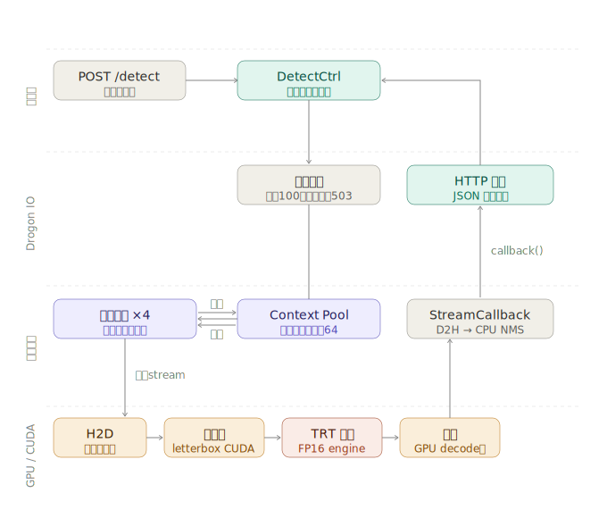

# yolo_trt

基于 TensorRT + Drogon 实现的 YOLOv8n 高性能目标检测推理服务。

CUDA 自定义 preprocess/postprocess kernel，cudaStreamAddCallback 全异步架构，context pool 动态扩容。

## 性能

测试环境：RTX 5060 Ti 16GB，TensorRT 10.8，FP16

| 并发 | QPS  | 平均延迟 | GPU sm% |
|------|------|---------|---------|
| 1    | -    | 2.5ms   | -       |
| 4    | 593  | 6.8ms   | -       |
| 16   | 1124 | 14ms    | 83%     |
| 32   | 1111 | 29ms    | ~85%    |

## 架构



## 版本演进

| 版本 | 说明 |
|------|------|
| v1   | 基础 TensorRT 推理，CPU preprocess |
| v2   | CUDA letterbox preprocess kernel |
| v3   | CUDA postprocess decode kernel |
| v4   | cudaStreamAddCallback 全异步，零阻塞 |
| **v5** | **Drogon HTTP 服务，context pool，多 worker 并发，完整版** |

## 快速开始

### 环境依赖

- CUDA 13.1
- TensorRT 10.8
- OpenCV
- Drogon

### 第一步：导出 ONNX

```bash
python step_0_export_model.py
```

### 第二步：验证 ONNX

```bash
python step_1_verify_onnx.py
```

### 第三步：转换为 TensorRT engine

```bash
bash step_2_onnx_to_engine.sh
```

### 第四步：编译（以 v5 为例）

```bash
cd v5
mkdir -p build && cd build
cmake ..
make -j
```

v1-v4 为中间优化版本，编译方式相同，详见各版本 README。

### 第五步：启动推理服务

```bash
./yolo_server ../../yolov8n.engine 8080
```

### 第六步：发送请求

```bash
curl -X POST http://localhost:8080/detect \
     -H "Content-Type: application/octet-stream" \
     --data-binary @image.jpg
```

返回示例：

```json
{
  "latency_ms": 2.54,
  "detections": [
    { "class": "person", "conf": 0.884, "x": 0.349, "y": 0.586, "w": 0.150, "h": 0.415 },
    { "class": "bus",    "conf": 0.862, "x": 0.510, "y": 0.462, "w": 0.948, "h": 0.498 }
  ]
}
```

### 健康检查

```bash
curl http://localhost:8080/health
```

```json
{
  "status": "ok",
  "processed": 11353,
  "ctx_total": 12,
  "ctx_idle": 8,
  "ctx_inflight": 4
}
```

### 压测

```bash
wrk -t4 -c16 -d10s -s post.lua http://localhost:8080/detect
```

`post.lua`：

```lua
wrk.method = "POST"
wrk.headers["Content-Type"] = "application/octet-stream"
wrk.body = io.open("image.jpg", "rb"):read("*all")
```
